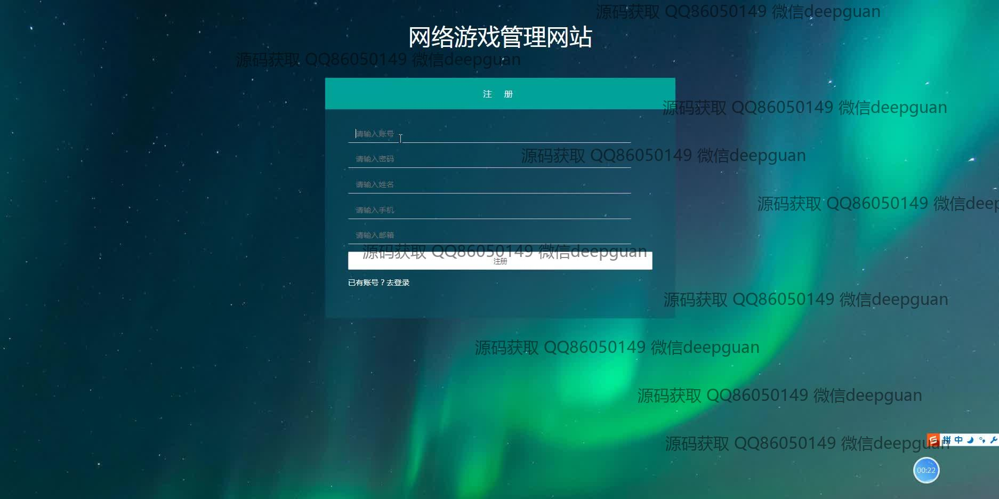

<h1 align="center">网络游戏公司官方平台设计与实现</h1>

## 简介
网络游戏公司官方平台：角色分为管理员、用户；包含用户管理、游戏信息展示、公司简介、招聘信息、客服支持等功能模块，注重用户体验及信息管理便捷性。    --计算机毕业设计源码；毕设源码；java毕业设计源码

## 联系方式

<h3 align="center">获取完整代码与数据库文件 + 微信：deepguan QQ: 86050149 QQ群: 783742310</h3>

<h3 align="center">可帮忙远程部署 包运行成功！提供远程部署、修改代码、设计文档指导、代码讲解等服务！</h3>

## 功能介绍（完整见运行截图）
管理员：提供登录、注册、退出功能，管理公司简介、游戏中心、招聘信息、用户信息、游戏类型等模块，支持游戏信息录入与编辑、招聘信息管理、公司信息维护，以及批量操作如添加和删除。后台界面包含搜索、筛选、分页等功能，确保高效管理平台内容。

用户：提供登录和注册功能，支持浏览平台主页，查看公司简介、游戏中心、招聘信息等内容，能通过搜索和筛选快速定位所需游戏或招聘信息。个人中心模块可查看和修改账户信息，包括用户名、密码、联系方式等。

客服：提供在线反馈和帮助功能，支持用户解决游戏使用或平台操作中遇到的问题，确保用户体验顺畅。可通过专属模块处理用户查询、反馈记录和跟进状态，提升服务效率。

访客：无需注册即可访问平台的公共信息，包括公司简介、游戏推荐、招聘信息等，通过直观的导航栏快速获取信息，提升平台的可访问性和友好性。

## 运行截图

本代码来源于网络,仅供学习参考使用!

